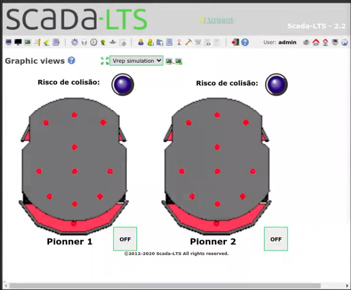

# EI MOZÃO (Amazon)
Sistema supervisório para automação industrial EI Mozão.

Nosso compromisso é com o desemprego, ele grande mas pode ser ainda
maior.


# Lembre-se das dependencias
```shell
pip install -r requirements.txt
```
A versão do Vrep usado foi a 4.0.0, talvez outras versões
apresente falhas.


# Conclusão do trabalho
Não use scadaLTS. (Opinião pessoal)


# Informações adicionais
Em SOs que usam linux, as primeiras 1024 portas são de uso
do super usuário (root), lembre-se de alterar a porta caso pegue
algum server feito em windows (que deus me dibre).
__Você tem que
refazer as views sempre que desligar o scadaLTS__


no arquivo __server_info.json__ está as confurações da porta e ip
do servidor ModBusTCP
Abra no vrep a simulação configurada e inicie a simulação

em outro terminal:
```shell
python client.py
```


cena criada para o trabalho


Scala view criada para o trabalho


# Video
Video no youtube explicado o projeto:
https://youtu.be/fwbcoR-_tUc